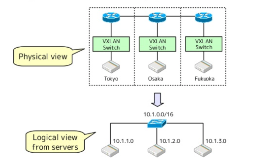
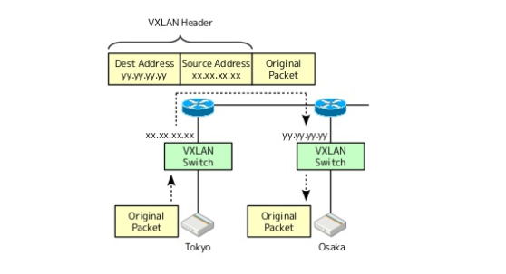

# VXLAN

This is a toy used to learn VXLAN.

Virtual Extensible LAN (VXLAN) is a network virtualization technology that attempts to address the scalability problems associated with large cloud computing deployments. It uses a VLAN-like encapsulation technique to encapsulate OSI layer 2 Ethernet frames within layer 4 UDP datagrams.

## The objective of VXLan

### 1, Create virtual L2 network over physical L3 network


### 2, VXLan encpasulates L2 packet inside L3 packet


### 3, `VTEP` implementaion

packet encpasulates is not enought for L2 over L3. VXLan device need to implement the following features.
- ARP resolution: Need to reply to ARP request from local servers without broadcasting the ARP packet.
- Destination search: Need to find the destination location corresponding to the destination MAC.

those features refered as `VTEP`(VXLAN endpoints, which terminate VXLAN tunnels and may be either virtual or physical switch ports, are known as VXLAN tunnel endpoints (VTEPs)).

there are some variations of `VETP` implementation, we use local agent and virtual VXLan switch run on Linux servers.

## Implementation `VTEP` in this project.

Create the vxlan device, Then as each remote host is discovered (either on startup or when they are added), do the following

- Create routing table entry for the remote subnet. It goes via the vxlan device but also specifies a next hop (of the remote host).
- Create a static ARP entry for the remote host IP address (and the VTEP MAC)
- Create an FDB entry with the VTEP MAC and the public IP of the remote daemon.

In this scheme the scaling of table entries is linear to the number of remote hosts - 1 route, 1 arp entry and 1 FDB entry per host.

use `etcd` as the key-value store to exchange information when remote host status changed(add, delete, update, etc...).

## Usage 

get the lastest release [binary](https://github.com/cssivision/vxlan/releases).

Run
```sh
sudo ./vxlan -etcdEndpoint http://etcd:2379
```

you will get log similar to the following.
```
INFO[0000] Determining IP address of default interface
INFO[0000] Using interface with name eth0 and address 10.146.0.3
INFO[0000] Defaulting external address to interface address (10.146.0.3)
INFO[0000] VXLAN device already exists
INFO[0000] Returning existing device
INFO[0000] subnet key expired in: 2018-02-25 09:23:53.467058164 +0000 UTC
INFO[0000] create subnet: 10.10.238.0, net mask: 24
INFO[0000] MTU: 1410
INFO[0000] VXLan HardwareAddr: 1a:0f:87:98:5e:c7
INFO[0000] Running backend.
INFO[0000] adding subnet: 10.5.10.0/24 PublicIP: 10.140.0.3 VtepMAC: f6:ad:73:33:de:0b
INFO[0000] calling AddARP: 10.5.10.0, f6:ad:73:33:de:0b
INFO[0000] calling AddFDB: 10.140.0.3, f6:ad:73:33:de:0b
``` 

## Use with docker
Docker daemon accepts --bip argument to configure the subnet of the docker0 bridge. It also accepts --mtu to set the MTU for docker0 and veth devices that it will be creating.

use `subnet` and `MTU` in log
```
INFO[0000] create subnet: 10.10.238.0, net mask: 24
INFO[0000] MTU: 1410
```
instead of `10.10.238.0/24` use `10.10.238.1/24` as the ip of the docker0 bridge.
```sh
dockerd --bip=${10.10.238.1/24} --mtu=1410 &
```

## Reference
- Flannel https://github.com/coreos/flannel
- VXLan attributes, Please consult the man page for `ip link` and see the vxlan section for more details.
- How VXLan work? https://www.slideshare.net/enakai/how-vxlan-works-on-linux
- how-vxlan-works-on-l2-and-across-l3-networks https://www.slideshare.net/anandnande/how-vxlan-works-on-l2-and-across-l3-networks
- IP route fundamental
    - https://www.thegeekstuff.com/2012/04/ip-routing-intro/
    - https://www.thegeekstuff.com/2012/04/route-examples/
    - https://www.thegeekstuff.com/2012/05/route-flags/
